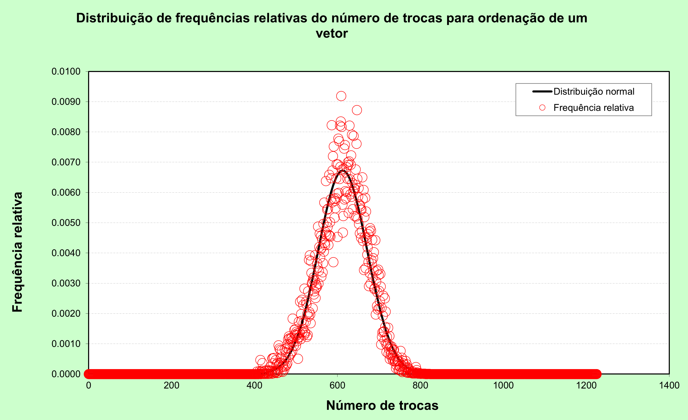

# Sobre esse repositório

Trabalho sobre simulação computacional das probabilidades associadas ao processo de ordenação para a disciplina Estatística e Probabilidades - UFMG - 2010 - Parte da grade curricular do curso de Engenharia Metalúrgica

# Novidades

Esse repositório foi criado como parte do resgate histórico de trabalhos que fiz na graduação em Engenharia Metalúrgica que envolveram algum nível de programação de computadores. Como parte do meu interesse sobre o assunto e também algumas discussões no post correspondente do [LinkedIN](https://www.linkedin.com/posts/ugcPost-7459763350416117760-1Y0k), estou resgatando as ideias presentes no trabalho e organizando o código antigo.

Umas das questões levantadas no post diz respeito à qual distribuição de probabilidades correspondia o número de trocas para ordenar o vetor. Não havia investigado o assunto na época e os gráficos que coloquei no trabalho escrito não foram dos melhores. A primeira linha de ataque à essa pergunta que eu fiz foi verificar se havia alguma menção no trabalho. Diante da ausência de qualquer menção sobre isso, comecei a pesquisar na Web sobre algum trabalho acadêmico ou técnico-profissional que abordasse o assunto. Com os termos de pesquisa que usei até o momento, não encontrei nenhuma referência específica. A minha hipótese, ainda não confirmada, é de que assemelha-se à uma distribuição normal mas testes estatísticos precisam ser feitos (antes disso preciso me familiarizar com eles - uma boa oportunidade de aprendizado).

O primeiro resultado, para vetores de 50 posições, 1 000 000 de vetores aleatórios, a distribuição normal e a curva de frequência relativa estão plotados no gráfico da Figura 1.

Figura 1: Curva de frequência relativa e distribuição normal para $E(x)=612.609$ e $\sigma = 59.340$ 
